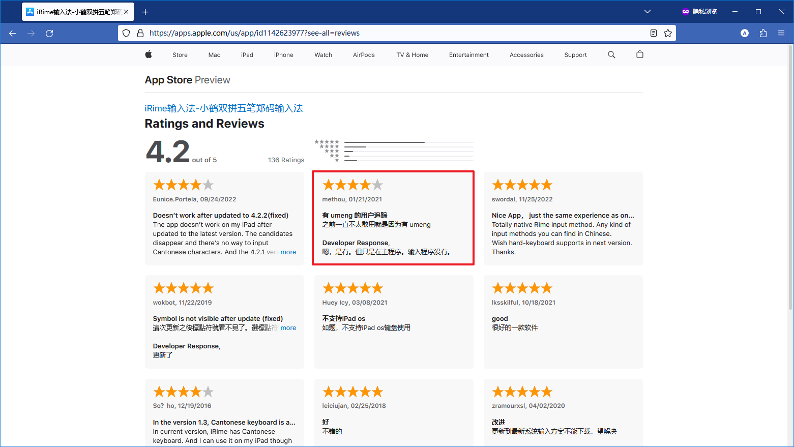

# Rime 用户配置

使用 GitHub Actions 自动集成以生成各个平台的 Rime 配置

## 包含方案

主要方案
- [🌟️星空键道](https://github.com/amorphobia/rime-jiandao)
- [袖珍简化字拼音](https://github.com/rime/rime-pinyin-simp)
- [日本語](https://github.com/gkovacs/rime-japanese)
- [蜀拼-重慶](https://github.com/Papnas/shupin)

Opencc 方案
- [繪文字](https://github.com/rime/rime-emoji)
- [➕️绘文字加](https://github.com/amorphobia/rime-emoji-plus)
- [OpenCC 简繁转换之通用规范汉字标准](https://github.com/amorphobia/opencc-tonggui)
- [OpenCC 转换之焱暒妏](https://github.com/amorphobia/opencc-martian)

## 使用

### 脚本安装

- [小狼毫](https://github.com/rime/weasel)：使用 PowerShell 运行下面的命令

```powershell
# 如果是第一次运行，可能需要这一条命令，之后不需要
Set-ExecutionPolicy RemoteSigned -Scope CurrentUser

# 直接安装
irm https://raw.githubusercontent.com/amorphobia/rime-user-config/master/scripts/installer.ps1 | iex

# 或者使用代理
$Proxy = "http://addr:port"
& ([scriptblock]::Create((irm -Proxy $Proxy https://raw.githubusercontent.com/amorphobia/rime-user-config/master/scripts/installer.ps1))) -Proxy $Proxy
```

### 下载安装

在[最新发布页面](https://github.com/amorphobia/rime-user-config/releases/latest)下载对应平台的 `zip` 文件

- 小狼毫：解压后，将文件夹内所有文件复制到 `%APPDATA%\Rime\` 中，重新部署
- [仓输入法](https://github.com/imfuxiao/Hamster)：直接用仓 App 打开 `zip` 文件即可
- [iRime](https://apps.apple.com/app/id1142623977)：用 iRime 主程序打开 `zip` 文件后重新部署
- [鼠须管](https://github.com/rime/squirrel)：解压后，将文件夹内所有内容复制到 `~/Library/Rime/` 中，重新部署

注：据美区用户反馈，iRime 主程序接入了[友盟+](https://www.umeng.com)进行用户追踪[^1]。


### 自动构建版本

在 [Actions](https://github.com/amorphobia/rime-user-config/actions) 页面选择要使用的构建，下载对应的 Artifacts。注意，自动构建版本比发布版多一层压缩。

## 待办

* [x] 生成[鼠须管](https://github.com/rime/squirrel)配置包
* [x] 电脑端一键安装脚本（小狼毫）
* [ ] 电脑端一键安装脚本（鼠须管）

[^1]: [商店评价页面](https://apps.apple.com/us/app/id1142623977?see-all=reviews)